# MySeat – Class Diagram

The diagram below covers the full backend class structure of the MySeat project, organised into five groups: **Entities & Enums**, **DTOs**, **Repositories**, **Services**, and **Controllers / Config**.

```mermaid
classDiagram

    %% ─────────────────────────────────────────
    %% ENUMS
    %% ─────────────────────────────────────────
    class Role {
        <<enumeration>>
        USER
        ADMIN
    }

    class BookingStatus {
        <<enumeration>>
        RESERVED
        CONFIRMED
        EXPIRED
    }

    class SeatStatus {
        <<enumeration>>
        AVAILABLE
        RESERVED
        BOOKED
    }

    %% ─────────────────────────────────────────
    %% ENTITIES
    %% ─────────────────────────────────────────
    class User {
        +Long id
        +String name
        +String email
        +String password
        +Role role
    }

    class Venue {
        +Long id
        +String name
        +String address
        +List~Section~ sections
    }

    class Section {
        +Long id
        +String name
        +Double price
        +Integer totalRows
        +Integer totalColumns
        +Venue venue
        +List~Seat~ seats
    }

    class Seat {
        +Long id
        +Integer rowNumber
        +Integer columnNumber
        +SeatStatus status
        +Long version
        +Section section
    }

    class Event {
        +Long id
        +String name
        +String description
        +String imageUrl
        +LocalDateTime eventDate
        +Venue venue
    }

    class Booking {
        +Long id
        +Double totalAmount
        +BookingStatus status
        +Instant reservedAt
        +Instant expiresAt
        +Instant confirmedAt
        +String payerName
        +String payerEmail
        +String paymentMethod
        +String paymentReference
        +User user
    }

    class BookingSeat {
        +Long id
        +Booking booking
        +Seat seat
    }

    %% Entity relationships
    User       "1" --> "1"  Role           : has
    Venue      "1" *-- "*"  Section        : contains
    Section    "1" *-- "*"  Seat           : contains
    Section    "*" --> "1"  Venue          : belongs to
    Seat       "*" --> "1"  Section        : belongs to
    Seat       "1" --> "1"  SeatStatus     : has
    Event      "*" --> "1"  Venue          : held at
    Booking    "*" --> "1"  User           : made by
    Booking    "1" --> "1"  BookingStatus  : has
    BookingSeat "*" --> "1" Booking        : links
    BookingSeat "*" --> "1" Seat           : links

    %% ─────────────────────────────────────────
    %% REPOSITORIES  (Spring Data JPA interfaces)
    %% ─────────────────────────────────────────
    class UserRepository {
        <<interface>>
        +Optional~User~ findByEmail(String email)
    }

    class VenueRepository {
        <<interface>>
        +Optional~Venue~ findByName(String name)
    }

    class EventRepository {
        <<interface>>
        +List~Event~ findAllByOrderByEventDateAsc()
    }

    class SectionRepository {
        <<interface>>
        +List~Section~ findByVenueId(Long venueId)
    }

    class SeatRepository {
        <<interface>>
        +List~Seat~ findBySectionVenueId(Long venueId)
        +long countBySectionId(Long sectionId)
    }

    class BookingRepository {
        <<interface>>
        +List~Booking~ findByStatusAndExpiresAtBefore(BookingStatus, Instant)
    }

    class BookingSeatRepository {
        <<interface>>
        +List~BookingSeat~ findByBookingId(Long bookingId)
    }

    %% Repository → Entity
    UserRepository       ..> User
    VenueRepository      ..> Venue
    EventRepository      ..> Event
    SectionRepository    ..> Section
    SeatRepository       ..> Seat
    BookingRepository    ..> Booking
    BookingSeatRepository ..> BookingSeat

    %% ─────────────────────────────────────────
    %% DTOs
    %% ─────────────────────────────────────────
    class LoginRequest {
        <<record>>
        +String email
        +String password
    }

    class LoginResponse {
        <<record>>
        +Long userId
        +String name
        +String email
        +Role role
        +String token
    }

    class CreateUserRequest {
        <<record>>
        +String name
        +String email
        +String password
        +Role role
    }

    class CreateVenueRequest {
        <<record>>
        +String name
        +String address
    }

    class CreateEventRequest {
        <<record>>
        +String name
        +String description
        +String imageUrl
        +String eventDate
        +Long venueId
        +CreateVenueRequest venue
    }

    class CreateSectionRequest {
        <<record>>
        +String name
        +Double price
        +Integer totalRows
        +Integer totalColumns
        +Long venueId
    }

    class CreateBookingRequest {
        <<record>>
        +Long userId
        +Long eventId
        +Long venueId
        +Long sectionId
        +List~Long~ seatIds
        +String payerName
        +String payerEmail
        +String paymentMethod
        +String paymentReference
    }

    class ConfirmBookingRequest {
        <<record>>
        +Long bookingId
    }

    class BookingResponse {
        <<record>>
        +Long bookingId
        +Double totalAmount
        +BookingStatus status
        +Instant expiresAt
        +List~Long~ seatIds
        +List~Long~ bookedSeatIds
    }

    class EventView {
        <<record>>
        +Long id
        +String name
        +String description
        +String imageUrl
        +LocalDateTime eventDate
        +Long venueId
        +String venueName
        +String venueAddress
    }

    class EventSectionView {
        <<record>>
        +Long sectionId
        +String sectionName
        +Double price
        +Integer totalRows
        +Integer totalColumns
    }

    class SeatView {
        <<record>>
        +Long id
        +Long sectionId
        +Integer rowNumber
        +Integer columnNumber
        +SeatStatus status
    }

    CreateEventRequest "1" --> "0..1" CreateVenueRequest : embeds

    %% ─────────────────────────────────────────
    %% CONFIG
    %% ─────────────────────────────────────────
    class JwtService {
        -String secret
        -long expirationMillis
        +String generateToken(User user)
        +String extractUsername(String token)
        +boolean isTokenValid(String token, User user)
    }

    class JwtAuthenticationFilter {
        -JwtService jwtService
        -UserRepository userRepository
        +void doFilterInternal(request, response, chain)
    }

    class SecurityConfig {
        -JwtAuthenticationFilter jwtAuthenticationFilter
        +SecurityFilterChain securityFilterChain(HttpSecurity)
        +PasswordEncoder passwordEncoder()
    }

    JwtAuthenticationFilter --> JwtService       : uses
    JwtAuthenticationFilter --> UserRepository   : uses
    SecurityConfig           --> JwtAuthenticationFilter : configures

    %% ─────────────────────────────────────────
    %% SERVICES
    %% ─────────────────────────────────────────
    class AuthService {
        -UserRepository userRepository
        -PasswordEncoder passwordEncoder
        -JwtService jwtService
        +LoginResponse login(LoginRequest)
    }

    class BookingService {
        -UserRepository userRepository
        -SectionRepository sectionRepository
        -SeatRepository seatRepository
        -BookingRepository bookingRepository
        -BookingSeatRepository bookingSeatRepository
        -EventRepository eventRepository
        +BookingResponse createBooking(CreateBookingRequest)
        +BookingResponse confirmBooking(ConfirmBookingRequest)
        +void expireStaleReservations()
    }

    class CatalogService {
        -EventRepository eventRepository
        -SectionRepository sectionRepository
        -SeatRepository seatRepository
        -UserRepository userRepository
        -VenueRepository venueRepository
        -BookingService bookingService
        -PasswordEncoder passwordEncoder
        +Event createEvent(CreateEventRequest)
        +List~EventView~ getEvents()
        +EventView getEventById(Long)
        +List~EventSectionView~ getSectionsForVenue(Long)
        +Venue createVenue(CreateVenueRequest)
        +List~Venue~ getVenues()
        +Section createSection(CreateSectionRequest)
        +User createUser(CreateUserRequest)
        +List~SeatView~ getSeatsForEvent(Long)
    }

    AuthService    --> UserRepository         : uses
    AuthService    --> JwtService             : uses
    BookingService --> UserRepository         : uses
    BookingService --> SectionRepository      : uses
    BookingService --> SeatRepository         : uses
    BookingService --> BookingRepository      : uses
    BookingService --> BookingSeatRepository  : uses
    BookingService --> EventRepository        : uses
    CatalogService --> EventRepository        : uses
    CatalogService --> SectionRepository      : uses
    CatalogService --> SeatRepository         : uses
    CatalogService --> UserRepository         : uses
    CatalogService --> VenueRepository        : uses
    CatalogService --> BookingService         : uses

    %% ─────────────────────────────────────────
    %% CONTROLLERS
    %% ─────────────────────────────────────────
    class AuthController {
        -AuthService authService
        +LoginResponse login(LoginRequest)
    }

    class BookingController {
        -BookingService bookingService
        +BookingResponse createBooking(CreateBookingRequest)
        +BookingResponse confirmBooking(ConfirmBookingRequest)
    }

    class CatalogController {
        -CatalogService catalogService
        +Event createEvent(CreateEventRequest)
        +List~EventView~ getEvents()
        +EventView getEventById(Long)
        +List~EventSectionView~ getSectionsForVenue(Long)
        +Venue createVenue(CreateVenueRequest)
        +List~Venue~ getVenues()
        +Section createSection(CreateSectionRequest)
        +User createUser(CreateUserRequest)
        +List~SeatView~ getSeatsForEvent(Long)
    }

    AuthController    --> AuthService    : uses
    BookingController --> BookingService : uses
    CatalogController --> CatalogService : uses
```

